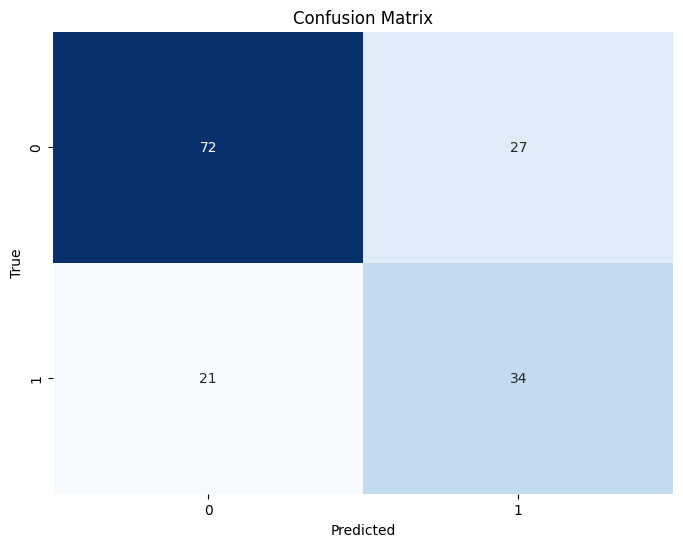
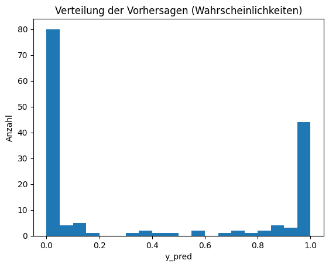
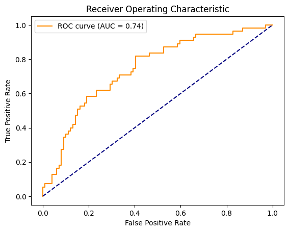
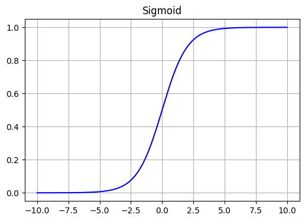
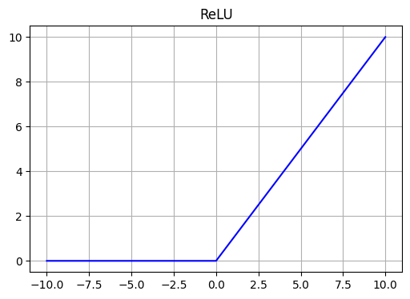
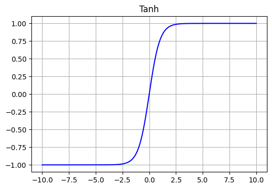

# 1. Own Implementation


```python
# imports
import numpy as np
import pandas as pd
#from scipy.special import expit  # Sigmoid
```


```python
class NeuralNetwork:

    def __init__(self, input_size = 8, hidden1_size=100, hidden2_size = 50, output_size = 1, lr=0.1):
        
        # Learning rate
        self.lr = lr
        # Weights and biases
        # Input -> Hidden1
        self.w0 = np.random.randn(hidden1_size, input_size) * 0.01
        self.b0 = np.zeros((hidden1_size, 1))

        # # Hidden1 → hidden2
        self.w1 = np.random.randn(hidden2_size, hidden1_size) * 0.01
        self.b1 = np.zeros((hidden2_size, 1))

        # Hidden2 -> Output
        self.w2 = np.random.randn(output_size, hidden2_size) * 0.01
        self.b2 = np.zeros((output_size, 1))

        # Activation values
        self.a0 = None
        self.a1 = None
        self.a2 = None


    ### Activation functions    
    # Sigmoid 
    def sigmoid(self, x):
        return 1 / (1 + np.exp(-x))
        #return expit(x)  
    
    def sigmoid_deriv(self, a):
        return a * (1 - a) 
    
    # ReLU 
    def relu(self, x):
        return np.maximum(0, x)
    
    def relu_deriv(self, a):
        return (a > 0).astype(float)
    
    # Tanh
    def tanh(x):
        return np.tanh(x)

    def tanh_deriv(a):
        return 1 - a**2

    # Loss function
    # Binary Cross-Entropy 
    def loss(self, y_true, y_pred):
        epsilon = 1e-12  # avoid log(0)
        y_pred = np.clip(y_pred, epsilon, 1 - epsilon) 
        loss = -np.mean(y_true * np.log(y_pred) + (1 - y_true) * np.log(1 - y_pred))
        return loss

    def loss_deriv(self, y_true, y_pred):
        epsilon = 1e-12
        y_pred = np.clip(y_pred, epsilon, 1 - epsilon)
        return (y_pred - y_true) / (y_pred * (1 - y_pred))

    def forward(self, X):

        self.X = X.T # X.T: (input_size, m)

        ### 1. Hidden Layer
        # z0 = W0 @ X_T + b0 
        # a0 = sig(z0)
        self.a0 = self.relu(self.w0 @ X.T + self.b0)
        
        ### 2. hidden layer 
        # z1 = W1 @ a0 + b1
        # a1 = sig(z1)
        self.a1 = self.relu(self.w1 @ self.a0 + self.b1)

        # output Layer
        self.a2 = self.sigmoid(self.w2 @ self.a1 + self.b2)
        
        return self.a2


    # Backward pass
    def backward(self, X, y_true):

        Y = y_true.T      # (output_size, m)
        m = Y.shape[1]    # samples

        y_true = y_true.T 

        ### OUTPUT LAYER
        # delta2 = self.a1 - y_true.T # optional this simple calculation
        delta2 = self.loss_deriv(Y, self.a2) * self.sigmoid_deriv(self.a2)

        # Gradients for w2, b2: 
        dw2 = (delta2 @ self.a1.T) / m  
        db2 = np.sum(delta2, axis=1, keepdims=True) / m

        ### HIDDEN LAYER 2
        # (weights output layer x error output layer) * derived activation 
        delta1 = (self.w2.T @ delta2) * self.relu_deriv(self.a1)

        # Gradients for w1, b1:
        # dw1: error in hidden layer 1 * outputs from hiddenlayer 2 (a2)
        dw1 = delta1 @ self.a0.T / m
        db1 = np.sum(delta1, axis=1, keepdims=True) / m # sum errors in current layer

        ### HIDDEN LAYER 1
        # Error back to the previous layer 
        delta0 = (self.w1.T @ delta1) * self.relu_deriv(self.a0)

        # Gradients for w0, b0: 
        dw0 = (delta0 @ self.X.T) / m 
        db0 = np.sum(delta0, axis=1, keepdims=True) / m

        # Update
        self.w2 -= self.lr * dw2
        self.b2 -= self.lr * db2
        self.w1 -= self.lr * dw1
        self.b1 -= self.lr * db1
        self.w0 -= self.lr * dw0
        self.b0 -= self.lr * db0


    def train(self, X, y):
        # Get the prediciton for current wheights
        y_pred = self.forward(X)

        # Compute the loss 
        current_loss = self.loss(y.T, y_pred)

        # Update the weights and biases
        self.backward(X, y)
        return current_loss


    def predict(self, X):
        a1 = self.forward(X)
        return a1.T


```

### Load and Prepare Data


```python
# Load csv file with pandas
df = pd.read_csv('data/diabetes.csv')

# drop all na values
df = df.dropna()
```


```python
from sklearn.preprocessing import StandardScaler, OneHotEncoder
from sklearn.model_selection import train_test_split

# one hot encoding of the target variable
X = df.drop('Outcome', axis=1).values  # shape: (n_samples, 8)
y = df['Outcome'].values.reshape(-1, 1)  # shape: (n_samples, 1)

# Skalieren der Eingabedaten
scaler = StandardScaler()
X = scaler.fit_transform(X)

# Train/Test Split
X_train, X_test, y_train, y_test = train_test_split(X, y, test_size=0.2, random_state=42)


print(X_train.shape)  # (614, 8)
print(y_train.shape)  # (614, 1)

```

    (614, 8)
    (614, 1)


### Train the Network 


```python
model = NeuralNetwork(input_size=8, hidden1_size=100, hidden2_size=50, output_size=1, lr=0.1)
# X_train: (n_samples, 784), y_train_oh: (n_samples, 10)
epochs = 100
losses = []
for epoch in range(epochs):
    loss = model.train(X_train, y_train)
    losses.append(loss)
    if epoch % 10 == 0:
        print(f"Epoch {epoch}: Loss = {loss:.4f}")


```

    Epoch 0: Loss = 0.6931
    Epoch 10: Loss = 0.6745
    Epoch 20: Loss = 0.6632
    Epoch 30: Loss = 0.6564
    Epoch 40: Loss = 0.6522
    Epoch 50: Loss = 0.6497
    Epoch 60: Loss = 0.6481
    Epoch 70: Loss = 0.6471
    Epoch 80: Loss = 0.6465
    Epoch 90: Loss = 0.6461


```python
tolerance = 1e-4   
patience = 200             
best_loss = float('inf')  
no_improvement = 0      
max_epochs = 10000

for epoch in range(max_epochs):
    loss = model.train(X_train, y_train)
    losses.append(loss)

    if epoch % 1000 == 0:
        print(f"Epoch {epoch}: Loss = {loss:.4f}")

    #
    if best_loss - loss > tolerance:
        best_loss = loss
        no_improvement = 0
    else:
        no_improvement += 1

    # 
    if no_improvement >= patience:
        print(f"\n Stop after erpch: {epoch}. no decresment after {patience} epochs")
        break

```

    Epoch 0: Loss = 0.6459
    Epoch 1000: Loss = 0.4447
    Epoch 2000: Loss = 0.3974
    Epoch 3000: Loss = 0.3463
    Epoch 4000: Loss = 0.2804
    Epoch 5000: Loss = 0.2218
    Epoch 6000: Loss = 0.1630
    Epoch 7000: Loss = 0.0896
    Epoch 8000: Loss = 0.0387
    Epoch 9000: Loss = 0.0200


```python
# Predict 
y_pred = model.predict(X_test)
# Convert predictions to binary with a threshold of 0.5
y_pred_binary = (y_pred >= 0.5).astype(int)
y_test_binary = y_test.astype(int)


# Calculate accuracy
accuracy = np.mean(y_pred_binary == y_test_binary)
print(f"Accuracy: {accuracy:.4f}")

# confussion matrix
from sklearn.metrics import confusion_matrix
import seaborn as sns
import matplotlib.pyplot as plt
cm = confusion_matrix(y_test_binary, y_pred_binary)
plt.figure(figsize=(8, 6))
sns.heatmap(cm, annot=True, fmt='d', cmap='Blues', cbar=False)
plt.xlabel('Predicted')
plt.ylabel('True')
plt.title('Confusion Matrix')
plt.show()

# print confusion matrix
print("Confusion Matrix:")
print(cm)

print("Mean y_pred:", np.mean(y_pred))


import matplotlib.pyplot as plt
plt.hist(y_pred, bins=20)
plt.title("Verteilung der Vorhersagen (Wahrscheinlichkeiten)")
plt.xlabel("y_pred")
plt.ylabel("Anzahl")
plt.show()


from sklearn.metrics import roc_curve, auc

fpr, tpr, _ = roc_curve(y_test, y_pred)
roc_auc = auc(fpr, tpr)

plt.figure()
plt.plot(fpr, tpr, color='darkorange', label=f'ROC curve (AUC = {roc_auc:.2f})')
plt.plot([0, 1], [0, 1], color='navy', linestyle='--')
plt.xlabel('False Positive Rate')
plt.ylabel('True Positive Rate')
plt.title('Receiver Operating Characteristic')
plt.legend()
plt.show()

```

    Accuracy: 0.7013


    

    


    Confusion Matrix:
    [[74 25]
     [21 34]]
    Mean y_pred: 0.3824814515599461


    

    


    

    


```python
import numpy as np
import matplotlib.pyplot as plt


def sigmoid(x):
    return 1 / (1 + np.exp(-x))


def relu(x):
    return np.maximum(0, x)

def tanh(x):
    return np.tanh(x)

# Wertebereich
x = np.linspace(-10, 10, 1000)

# Auswerten der Funktionen
sig = sigmoid(x)

r = relu(x)

t = tanh(x)


# Einzelne Plots generieren
def plot_function(x, y, title, color='blue'):
    plt.figure(figsize=(6, 4))
    plt.plot(x, y, color=color)
    plt.title(title)
    plt.grid(True)
    plt.show()

# Plotten
plot_function(x, sig, 'Sigmoid')

plot_function(x, r, 'ReLU')

plot_function(x, t, 'Tanh')

```


    

    


    

    


    

    


# 2. PyTorch 


```python
import torch
from torch.utils.data import DataLoader, TensorDataset

import torch.nn as nn
import torch.optim as optim

class NeuralNetworkPyTorch(nn.Module):
    def __init__(self, input_size=8, hidden1_size=100, hidden2_size=50, output_size=2):
        super(NeuralNetworkPyTorch, self).__init__()
        self.fc1 = nn.Linear(input_size, hidden1_size)
        self.fc2 = nn.Linear(hidden1_size, hidden2_size)
        self.fc3 = nn.Linear(hidden2_size, output_size)
        self.sigmoid = nn.Sigmoid()

    def forward(self, x):
        x = self.sigmoid(self.fc1(x))
        x = self.sigmoid(self.fc2(x))
        x = self.fc3(x)
        return x

# Hyperparameter
input_size = 8
hidden1_size = 100
hidden2_size = 50
output_size = 2
lr = 0.2
epochs = 100


# data in torch tensors
X_train_tensor = torch.tensor(X_train, dtype=torch.float32)
y_train_tensor = torch.tensor(y_train, dtype=torch.float32)
X_test_tensor = torch.tensor(X_test, dtype=torch.float32)
y_test_tensor = torch.tensor(y_test, dtype=torch.float32)


# Modell, Loss und Optimizer
model = NeuralNetworkPyTorch(input_size, hidden1_size, hidden2_size, output_size)
criterion = nn.CrossEntropyLoss()
optimizer = optim.SGD(model.parameters(), lr=lr)

for epoch in range(epochs):
    model.train()
    optimizer.zero_grad()
    outputs = model(X_train_tensor)
    loss = criterion(outputs, y_train_tensor)
    loss.backward()
    optimizer.step()
    if epoch % 10 == 0:
        print(f"Epoch {epoch}: Loss = {loss.item():.4f}")

# Training
for epoch in range(epochs):
    model.train()
    epoch_loss = 0.0
    for batch_X, batch_y in train_loader:
        optimizer.zero_grad()
        outputs = model(batch_X)
        loss = criterion(outputs, torch.argmax(batch_y, dim=1))
        loss.backward()
        optimizer.step()
        epoch_loss += loss.item()
    if epoch % 10 == 0:
        print(f"Epoch {epoch}: Loss = {epoch_loss:.4f}")

# Evaluation
model.eval()
with torch.no_grad():
    y_pred = model(X_test_tensor)
    y_pred_classes = torch.argmax(y_pred, dim=1).detach().numpy()
    y_test_classes = y_test_tensor.detach().numpy()
    accuracy = (y_pred_classes == y_test_classes).mean()
    print(f"Accuracy: {accuracy:.4f}")
```


    ---------------------------------------------------------------------------

    RuntimeError                              Traceback (most recent call last)

    Cell In[134], line 48
         46 optimizer.zero_grad()
         47 outputs = model(X_train_tensor)
    ---> 48 loss = criterion(outputs, y_train_tensor)
         49 loss.backward()
         50 optimizer.step()


    File /opt/homebrew/Caskroom/miniconda/base/envs/torch-env/lib/python3.11/site-packages/torch/nn/modules/module.py:1736, in Module._wrapped_call_impl(self, *args, **kwargs)
       1734     return self._compiled_call_impl(*args, **kwargs)  # type: ignore[misc]
       1735 else:
    -> 1736     return self._call_impl(*args, **kwargs)


    File /opt/homebrew/Caskroom/miniconda/base/envs/torch-env/lib/python3.11/site-packages/torch/nn/modules/module.py:1747, in Module._call_impl(self, *args, **kwargs)
       1742 # If we don't have any hooks, we want to skip the rest of the logic in
       1743 # this function, and just call forward.
       1744 if not (self._backward_hooks or self._backward_pre_hooks or self._forward_hooks or self._forward_pre_hooks
       1745         or _global_backward_pre_hooks or _global_backward_hooks
       1746         or _global_forward_hooks or _global_forward_pre_hooks):
    -> 1747     return forward_call(*args, **kwargs)
       1749 result = None
       1750 called_always_called_hooks = set()


    File /opt/homebrew/Caskroom/miniconda/base/envs/torch-env/lib/python3.11/site-packages/torch/nn/modules/loss.py:1293, in CrossEntropyLoss.forward(self, input, target)
       1292 def forward(self, input: Tensor, target: Tensor) -> Tensor:
    -> 1293     return F.cross_entropy(
       1294         input,
       1295         target,
       1296         weight=self.weight,
       1297         ignore_index=self.ignore_index,
       1298         reduction=self.reduction,
       1299         label_smoothing=self.label_smoothing,
       1300     )


    File /opt/homebrew/Caskroom/miniconda/base/envs/torch-env/lib/python3.11/site-packages/torch/nn/functional.py:3479, in cross_entropy(input, target, weight, size_average, ignore_index, reduce, reduction, label_smoothing)
       3477 if size_average is not None or reduce is not None:
       3478     reduction = _Reduction.legacy_get_string(size_average, reduce)
    -> 3479 return torch._C._nn.cross_entropy_loss(
       3480     input,
       3481     target,
       3482     weight,
       3483     _Reduction.get_enum(reduction),
       3484     ignore_index,
       3485     label_smoothing,
       3486 )


    RuntimeError: 0D or 1D target tensor expected, multi-target not supported


# LLM Implementation


Prompt: 
Implement a framework for neural networks (NN). Implement the entire network from scratch, including forward and backward propagation methods


```python
import numpy as np

# Base class for layers
class Layer:
    def forward(self, input):
        raise NotImplementedError
        
    def backward(self, output_gradient, learning_rate):
        raise NotImplementedError

# Dense (fully connected) layer
class Dense(Layer):
    def __init__(self, input_size, output_size):
        self.weights = np.random.randn(input_size, output_size) * np.sqrt(2. / input_size)
        self.bias = np.zeros((1, output_size))

    def forward(self, input):
        self.input = input
        return np.dot(input, self.weights) + self.bias

    def backward(self, output_gradient, learning_rate):
        weights_gradient = np.dot(self.input.T, output_gradient)
        input_gradient = np.dot(output_gradient, self.weights.T)
        self.weights -= learning_rate * weights_gradient
        self.bias -= learning_rate * np.mean(output_gradient, axis=0, keepdims=True)
        return input_gradient

# Activation functions
class Activation(Layer):
    def __init__(self, activation, activation_prime):
        self.activation = activation
        self.activation_prime = activation_prime

    def forward(self, input):
        self.input = input
        return self.activation(input)

    def backward(self, output_gradient, learning_rate):
        return self.activation_prime(self.input) * output_gradient

# Specific activation functions
def relu(x):
    return np.maximum(0, x)

def relu_prime(x):
    return (x > 0).astype(float)

def sigmoid(x):
    return 1 / (1 + np.exp(-x))

def sigmoid_prime(x):
    s = sigmoid(x)
    return s * (1 - s)

# Loss function
class MeanSquaredError:
    def loss(self, predicted, actual):
        return np.mean(np.power(predicted - actual, 2))

    def gradient(self, predicted, actual):
        return 2 * (predicted - actual) / actual.size

# Neural network class
class NeuralNetwork2:
    def __init__(self):
        self.layers = []
        self.loss_fn = MeanSquaredError()

    def add(self, layer):
        self.layers.append(layer)

    def predict(self, x):
        output = x
        for layer in self.layers:
            output = layer.forward(output)
        return output

    def train(self, x_train, y_train, epochs, learning_rate):
        for epoch in range(epochs):
            output = self.predict(x_train)
            loss = self.loss_fn.loss(output, y_train)
            grad = self.loss_fn.gradient(output, y_train)
            
            for layer in reversed(self.layers):
                grad = layer.backward(grad, learning_rate)
            
            if (epoch + 1) % 100 == 0 or epoch == 0:
                print(f"Epoch {epoch + 1}, Loss: {loss:.4f}")
```


```python
nn = NeuralNetwork2()
nn.add(Dense(8, 4))
nn.add(Activation(relu, relu_prime))
nn.add(Dense(4, 1))
nn.add(Activation(sigmoid, sigmoid_prime))

# X_train, X_test, y_train, y_test = train_test_split(X, y, test_size=0.2, random_state=42)
nn.train(X_train, y_train, epochs=1000, learning_rate=0.1)

# Predictions
preds = nn.predict(X_train)
print("Predictions:")
print(preds)

pred_classes = (preds >= 0.5).astype(int)

true_classes = y_train.reshape(-1, 1)

# Accuracy 
accuracy = np.mean(pred_classes == true_classes)
print(f"Accuracy: {accuracy:.4f}")

```

    Epoch 1, Loss: 0.2819
    Epoch 100, Loss: 0.2229
    Epoch 200, Loss: 0.2069
    Epoch 300, Loss: 0.1909
    Epoch 400, Loss: 0.1773
    Epoch 500, Loss: 0.1684
    Epoch 600, Loss: 0.1627
    Epoch 700, Loss: 0.1589
    Epoch 800, Loss: 0.1560
    Epoch 900, Loss: 0.1537
    Epoch 1000, Loss: 0.1521
    Predictions:
    [[5.07946905e-03]
     [5.36302217e-01]
     [5.26832140e-01]
     [4.67194773e-01]
     [5.08737611e-01]
     [2.12597748e-01]
     [4.75399703e-01]
     [6.40076316e-01]
     [1.59568753e-01]
     [1.33779620e-02]
     [1.00617473e-01]
     [8.76415096e-01]
     [4.22706151e-02]
     [4.52085519e-01]
     [7.53171779e-01]
     [7.16236449e-01]
     [6.15975167e-01]
     [2.04708540e-01]
     [4.78460628e-01]
     [7.49919896e-01]
     [5.64381196e-01]
     [7.43535770e-02]
     [4.33788402e-01]
     [3.77232181e-01]
     [3.38277277e-01]
     [1.60980396e-01]
     [4.98654887e-01]
     [5.80813249e-01]
     [4.98654887e-01]
     [8.26282577e-01]
     [7.77118036e-01]
     [6.02053890e-02]
     [3.67297297e-02]
     [1.61541262e-01]
     [7.15099916e-01]
     [6.02217137e-01]
     [6.26597285e-02]
     [1.27894634e-01]
     [8.45481864e-01]
     [3.86900865e-01]
     [4.02271234e-02]
     [5.38764289e-02]
     [6.58266595e-04]
     [1.11167101e-01]
     [2.98862394e-01]
     [7.25148306e-01]
     [3.15058962e-01]
     [7.14638956e-02]
     [3.10907728e-01]
     [2.49222480e-01]
     [7.20707127e-01]
     [8.21185250e-02]
     [8.11871078e-02]
     [1.39000132e-01]
     [7.98650314e-01]
     [8.15828536e-01]
     [3.80569843e-01]
     [3.01310852e-01]
     [1.37938551e-01]
     [1.20318682e-01]
     [6.28776952e-01]
     [1.21195036e-01]
     [5.47869687e-01]
     [3.14334267e-01]
     [3.38157970e-01]
     [8.25550718e-01]
     [7.04045384e-01]
     [1.12112329e-01]
     [7.95324207e-02]
     [2.02391641e-01]
     [1.57404087e-01]
     [5.70054095e-01]
     [1.81488022e-01]
     [4.28963032e-01]
     [3.89867738e-01]
     [1.71795870e-01]
     [6.20476240e-02]
     [3.95478490e-02]
     [4.75804276e-01]
     [5.72588038e-01]
     [4.98654887e-01]
     [1.58842750e-01]
     [1.02324157e-01]
     [3.38715296e-01]
     [5.72330963e-01]
     [7.01237031e-01]
     [1.31792121e-01]
     [2.76324044e-02]
     [5.69767537e-01]
     [1.49890242e-01]
     [1.13136777e-01]
     [2.66950211e-01]
     [7.60909098e-01]
     [1.46038853e-01]
     [4.98654887e-01]
     [2.33657468e-01]
     [2.53974190e-01]
     [3.55240670e-04]
     [6.18128048e-01]
     [1.38075534e-01]
     [9.30066464e-02]
     [6.62968559e-01]
     [2.24546589e-01]
     [4.80303365e-01]
     [1.60561220e-01]
     [5.14944505e-02]
     [5.36130706e-01]
     [5.40946131e-01]
     [2.40848172e-01]
     [1.94885457e-02]
     [4.48839846e-01]
     [7.34495939e-02]
     [4.98654887e-01]
     [1.70114756e-01]
     [2.02426553e-02]
     [2.46243997e-01]
     [1.45775159e-01]
     [2.03694272e-01]
     [7.34920478e-01]
     [5.48003871e-01]
     [1.95004830e-01]
     [1.06507509e-01]
     [6.99220444e-02]
     [7.92359939e-01]
     [2.39770471e-01]
     [3.62179288e-01]
     [4.65477039e-01]
     [7.68615328e-01]
     [8.68685735e-01]
     [8.69848400e-01]
     [1.43026922e-01]
     [3.00171533e-01]
     [8.21586740e-01]
     [5.76260590e-01]
     [1.85745972e-02]
     [7.05045124e-01]
     [8.54494657e-02]
     [3.78452359e-01]
     [8.15772751e-01]
     [1.85185121e-01]
     [5.80417118e-01]
     [1.38086181e-01]
     [1.98004637e-01]
     [8.11157781e-01]
     [2.45473196e-01]
     [2.17775098e-01]
     [1.47788188e-01]
     [4.98654887e-01]
     [7.66253664e-01]
     [2.08946717e-02]
     [6.81750746e-02]
     [3.02426150e-02]
     [4.70544476e-04]
     [3.66704769e-01]
     [7.78827152e-03]
     [4.63931548e-02]
     [6.87094555e-02]
     [9.18592543e-01]
     [6.60092422e-01]
     [1.77140790e-02]
     [2.55666409e-01]
     [9.58212533e-02]
     [7.90897132e-01]
     [1.14998357e-01]
     [3.47208205e-02]
     [6.22865119e-02]
     [4.98654887e-01]
     [3.27052139e-01]
     [8.55842739e-01]
     [2.02680485e-02]
     [2.85886628e-01]
     [4.59496641e-01]
     [2.32157507e-01]
     [2.44980154e-01]
     [6.02892747e-01]
     [5.86049467e-04]
     [1.40290942e-01]
     [8.82259873e-02]
     [2.27328707e-02]
     [4.98654887e-01]
     [2.24141928e-01]
     [6.37910540e-02]
     [8.39949060e-01]
     [6.78394441e-01]
     [1.74699742e-01]
     [1.97595718e-01]
     [3.78101016e-01]
     [2.26733572e-01]
     [1.63101248e-01]
     [8.64085181e-01]
     [8.13398472e-01]
     [8.33525045e-01]
     [2.22105889e-02]
     [1.05980419e-01]
     [5.14647615e-02]
     [2.75973294e-01]
     [1.10511481e-01]
     [4.98654887e-01]
     [8.75703848e-01]
     [8.19800261e-01]
     [2.51783290e-01]
     [1.64364260e-01]
     [4.98654887e-01]
     [2.26700403e-01]
     [3.22655470e-01]
     [5.16268353e-01]
     [5.22513798e-01]
     [7.08878385e-01]
     [6.31871847e-01]
     [4.48786818e-01]
     [8.00810363e-02]
     [6.09912066e-02]
     [2.62172231e-01]
     [7.31574869e-02]
     [5.51779887e-01]
     [5.44969561e-01]
     [3.89596737e-03]
     [1.97827530e-03]
     [6.57480480e-01]
     [6.01420348e-01]
     [7.33797080e-01]
     [3.90782113e-02]
     [4.98654887e-01]
     [5.24108424e-01]
     [1.54679642e-01]
     [4.73262784e-01]
     [1.93176635e-01]
     [8.19666253e-01]
     [9.98184430e-01]
     [6.94536116e-01]
     [3.43876420e-01]
     [1.58232172e-01]
     [6.19929032e-01]
     [3.15451815e-01]
     [2.14742001e-02]
     [3.54478180e-01]
     [4.06950450e-01]
     [3.68706235e-02]
     [2.11518523e-01]
     [7.55068346e-01]
     [6.25588521e-01]
     [9.47425734e-01]
     [4.54696513e-01]
     [6.60743709e-01]
     [7.44922038e-01]
     [4.98654887e-01]
     [1.19317632e-01]
     [1.34776041e-01]
     [5.33451357e-02]
     [2.26066322e-01]
     [1.65320893e-01]
     [1.95519897e-01]
     [2.94850517e-01]
     [8.74275451e-01]
     [4.42652709e-01]
     [4.01181234e-01]
     [3.32871804e-01]
     [5.57548719e-02]
     [2.02021150e-01]
     [4.48086638e-01]
     [3.32918950e-01]
     [8.25195489e-01]
     [6.53292564e-01]
     [4.60159426e-02]
     [9.08331598e-01]
     [2.97782222e-01]
     [2.19409957e-01]
     [4.98654887e-01]
     [3.30534359e-01]
     [1.43557074e-01]
     [9.07138507e-02]
     [3.16058650e-01]
     [9.39599107e-01]
     [4.98654887e-01]
     [4.45626747e-01]
     [4.17376003e-02]
     [1.78124612e-01]
     [2.53356849e-01]
     [8.72932955e-01]
     [9.10324765e-01]
     [6.05872048e-01]
     [6.29721560e-01]
     [7.31077114e-02]
     [5.33004801e-02]
     [5.77430595e-01]
     [1.30602191e-01]
     [4.94645214e-01]
     [1.24187689e-01]
     [8.97711449e-01]
     [1.81687825e-02]
     [3.63226129e-01]
     [3.62888579e-01]
     [2.19694121e-01]
     [6.36037386e-01]
     [3.59535978e-01]
     [7.01855289e-01]
     [2.28120446e-01]
     [1.73120726e-01]
     [5.45645508e-01]
     [9.40308783e-01]
     [1.02637644e-01]
     [9.70329963e-02]
     [5.22295780e-01]
     [8.98707008e-01]
     [1.48906108e-01]
     [1.87694454e-01]
     [6.42217829e-02]
     [5.30003122e-01]
     [1.02647003e-01]
     [3.51873231e-01]
     [4.98654887e-01]
     [6.86627484e-02]
     [6.56493550e-03]
     [3.10770852e-01]
     [2.55826225e-01]
     [5.99367460e-01]
     [9.80120414e-01]
     [7.32131076e-01]
     [4.97130395e-01]
     [6.49345162e-01]
     [5.70409363e-01]
     [2.75871878e-01]
     [5.83860538e-01]
     [1.82040788e-01]
     [4.47616455e-02]
     [4.71607090e-02]
     [9.41011497e-02]
     [3.80793976e-02]
     [4.23408667e-01]
     [5.64161730e-01]
     [5.97784965e-02]
     [7.09209078e-01]
     [6.27889492e-01]
     [7.07823303e-02]
     [5.74773995e-01]
     [6.32241341e-01]
     [4.27416427e-02]
     [7.11396039e-01]
     [1.58893803e-02]
     [5.30220229e-01]
     [5.03354571e-01]
     [2.23396754e-02]
     [5.21993847e-01]
     [2.91414461e-01]
     [3.88042134e-01]
     [1.09855896e-01]
     [9.24672591e-01]
     [3.29809384e-01]
     [5.66743477e-01]
     [8.68469348e-01]
     [8.35464646e-01]
     [2.98514412e-01]
     [7.75153398e-01]
     [8.92471947e-01]
     [4.97573463e-01]
     [1.69789100e-01]
     [8.18232455e-02]
     [1.06190279e-01]
     [6.52298387e-01]
     [1.24669816e-01]
     [4.25825107e-01]
     [1.70461581e-01]
     [2.91546710e-01]
     [2.02298467e-01]
     [4.98654887e-01]
     [4.18184788e-01]
     [8.85100198e-01]
     [1.78037134e-01]
     [7.61961250e-02]
     [1.36800153e-01]
     [5.44628095e-01]
     [1.88857935e-01]
     [5.27195780e-01]
     [2.30367085e-02]
     [4.46011074e-02]
     [2.57487527e-01]
     [4.30636121e-02]
     [7.28293273e-01]
     [2.25662163e-01]
     [9.41045019e-02]
     [4.97602265e-01]
     [6.60444054e-01]
     [4.91247378e-02]
     [6.26710494e-02]
     [5.26690766e-01]
     [6.88220667e-02]
     [6.76310630e-01]
     [2.16628102e-01]
     [5.25896112e-02]
     [5.64043735e-01]
     [2.97545624e-02]
     [3.72046148e-01]
     [3.20440128e-01]
     [8.37905971e-02]
     [2.28967302e-01]
     [5.42920971e-01]
     [4.09626722e-01]
     [2.50593255e-01]
     [8.82668827e-02]
     [7.55417782e-02]
     [7.55815272e-02]
     [3.59745200e-01]
     [3.79510798e-02]
     [1.75304799e-01]
     [7.95433634e-01]
     [6.66921788e-01]
     [5.77071888e-02]
     [5.91598814e-02]
     [4.71864162e-01]
     [6.83295836e-01]
     [4.98654887e-01]
     [3.65060906e-02]
     [4.98654887e-01]
     [1.78812812e-01]
     [7.53749433e-02]
     [1.01596354e-01]
     [5.89120842e-01]
     [2.80354419e-01]
     [1.57675855e-01]
     [6.18880770e-02]
     [9.38328622e-02]
     [1.24618044e-02]
     [4.99608722e-01]
     [5.07732943e-01]
     [2.70819117e-01]
     [1.58565386e-01]
     [4.71005145e-01]
     [1.45871225e-01]
     [8.23396673e-02]
     [6.80842712e-02]
     [4.98654887e-01]
     [3.73431290e-01]
     [8.93970055e-01]
     [8.87524321e-01]
     [2.85288415e-01]
     [4.64551140e-01]
     [9.38859076e-01]
     [4.96116786e-01]
     [8.40412640e-01]
     [2.62078460e-01]
     [5.81819616e-02]
     [2.39783073e-01]
     [2.98002676e-02]
     [1.01687955e-02]
     [7.99273216e-01]
     [1.12178277e-01]
     [4.66597237e-01]
     [2.67797320e-01]
     [7.40833451e-01]
     [1.64056776e-01]
     [1.89253146e-01]
     [2.05218296e-01]
     [5.80612022e-01]
     [4.78556860e-01]
     [3.13342731e-02]
     [1.48362990e-01]
     [4.95319072e-02]
     [1.35124754e-01]
     [3.14244059e-01]
     [2.67583782e-01]
     [1.03010260e-01]
     [2.38506380e-01]
     [5.18815330e-01]
     [4.55387700e-01]
     [6.07153100e-01]
     [5.41794109e-01]
     [3.81770546e-01]
     [8.57413290e-02]
     [4.15505937e-01]
     [2.13742619e-01]
     [3.77829924e-01]
     [9.47272775e-01]
     [4.47954235e-01]
     [1.53893717e-01]
     [5.20115484e-01]
     [2.99838642e-01]
     [6.41739341e-01]
     [2.40389597e-01]
     [5.41360597e-01]
     [5.13852771e-01]
     [2.05370212e-01]
     [4.11898782e-02]
     [2.01703444e-01]
     [4.11911722e-01]
     [5.26371646e-02]
     [5.66707945e-01]
     [8.90150117e-01]
     [2.26511432e-01]
     [1.64287635e-01]
     [2.93246001e-01]
     [4.42417301e-01]
     [9.46307781e-01]
     [5.27905110e-01]
     [1.27984442e-01]
     [8.25968302e-01]
     [9.49570839e-01]
     [8.86278571e-02]
     [2.50556682e-01]
     [3.96077492e-01]
     [5.44214529e-03]
     [1.24816385e-02]
     [5.24699759e-02]
     [1.08948894e-01]
     [3.28609084e-02]
     [4.72426562e-02]
     [4.61535002e-01]
     [7.04208314e-01]
     [8.54106313e-01]
     [8.16319735e-01]
     [5.50346720e-02]
     [1.26020958e-02]
     [8.61884786e-01]
     [4.73471800e-01]
     [7.51311637e-01]
     [1.77119077e-01]
     [1.96751897e-02]
     [1.97724153e-01]
     [8.17348641e-01]
     [3.25039818e-01]
     [3.47300241e-01]
     [9.48928588e-03]
     [4.98654887e-01]
     [6.51787110e-01]
     [7.68314614e-02]
     [7.87493432e-01]
     [8.04687763e-02]
     [1.75834841e-01]
     [3.36470371e-01]
     [2.61736550e-01]
     [5.84707000e-02]
     [4.09973552e-01]
     [7.90864787e-01]
     [1.99753317e-01]
     [1.40381505e-02]
     [8.79848079e-01]
     [3.07768970e-01]
     [4.23293932e-01]
     [5.01056816e-01]
     [2.42043515e-01]
     [3.52605373e-01]
     [4.83202820e-01]
     [1.53308216e-01]
     [3.29138413e-01]
     [7.75072909e-02]
     [1.92264676e-01]
     [3.07639995e-02]
     [3.33039184e-01]
     [8.75084335e-01]
     [9.60882139e-02]
     [8.28226099e-02]
     [4.87072275e-01]
     [6.60611574e-02]
     [7.59435530e-01]
     [2.63840075e-01]
     [3.17421268e-01]
     [3.62745021e-01]
     [8.59351182e-01]
     [8.25414302e-02]
     [5.92171368e-01]
     [9.65466726e-02]
     [4.98654887e-01]
     [3.10375060e-01]
     [4.29837449e-02]
     [3.88310328e-01]
     [9.02666227e-03]
     [5.51014360e-01]
     [9.17617253e-01]
     [4.34619539e-01]
     [7.86435262e-01]
     [3.74376514e-01]
     [1.24010364e-01]
     [4.97360878e-01]
     [1.25209484e-01]
     [9.53060657e-02]
     [2.11784608e-01]
     [5.09716295e-01]
     [6.78736383e-01]
     [4.32932285e-01]
     [8.85506271e-01]
     [1.46551812e-01]
     [6.69408962e-01]
     [2.86494889e-01]
     [4.98654887e-01]
     [2.79468361e-02]
     [4.14161695e-01]
     [3.47778714e-01]
     [5.65204002e-01]
     [5.20994101e-01]
     [1.45400054e-01]
     [3.92598131e-01]
     [1.27150850e-01]
     [2.40737115e-01]
     [6.92480948e-02]
     [3.35707895e-01]
     [2.22041250e-01]
     [9.83599088e-01]
     [6.43833216e-01]
     [8.13687468e-01]
     [5.44422535e-01]
     [8.02200555e-02]
     [2.62388899e-01]
     [8.58792485e-01]
     [4.05669231e-01]
     [4.37631669e-01]
     [3.12191991e-02]
     [1.28803142e-01]
     [7.24765034e-01]
     [5.03041069e-01]
     [4.15714564e-01]
     [4.28452819e-01]
     [7.97122911e-03]
     [8.64212621e-01]
     [6.36997932e-01]
     [4.97727840e-02]]
    Accuracy: 0.7704

